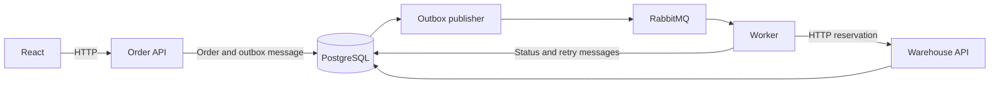

# OrderBridge

OrderBridge connects an order form to a warehouse service. The frontend is built with React, the backend with ASP.NET Core, and orders are processed through RabbitMQ and stored in PostgreSQL.

The project focuses on what happens when the warehouse is slow or unavailable: retries, failed orders, replay and avoiding duplicate stock reservations.

## Web demo

[Try OrderBridge](https://orderbridge-hugo-demo.hugomelander1.chatgpt.site)

Create an order, change the warehouse mode and follow the timeline. The public demo runs a browser simulation; it does not connect to the .NET backend, PostgreSQL or RabbitMQ. Each visitor has separate data, which resets on reload. The full backend can be run locally using the instructions below.

## Run locally

`localhost:5173` points to your own computer. Use the public demo above to try the interface without installing anything, or start the full backend below.

Install Docker Desktop, enable Linux containers and make sure Docker is running. From the repository folder, run:

```sh
docker compose up --build
```

When the services have started, open <http://localhost:5173>.

The first start creates the database and adds three products. Orders and stock are kept in Docker volumes between restarts. You can override the local passwords by copying `.env.example` to `.env`, but the defaults work without extra setup.

| Service | Address |
| --- | --- |
| Web app | http://localhost:5173 |
| Order API | http://localhost:5080 |
| Order API specification | http://localhost:5080/openapi/v1.json |
| Warehouse API specification | http://localhost:5081/openapi/v1.json |
| RabbitMQ management | http://localhost:15672 |
| PostgreSQL | localhost:5432 |

RabbitMQ login: `orderbridge` / `orderbridge-local`. Compose binds the ports to your computer's loopback address.

If the page does not open, check that Docker is running and inspect the services:

```sh
docker compose ps
docker compose logs api frontend
```

## Try it

Create an order and open its details to follow the processing timeline. The demo panel lets you change how the warehouse responds.

To try a retry, select **TemporaryError**, create an order, then switch back to **Normal**. The order should become **Reserved**, with one successful reservation. Leaving the error enabled causes the order to fail after four attempts; you can then restore Normal and replay it.

The [demo guide](docs/demo.md) also covers insufficient stock, timeouts and restarting the worker.

## How it works



The API saves each order and its outgoing message in the same transaction. A worker publishes the message to RabbitMQ and calls the warehouse to reserve stock.

Messages can be delivered more than once. The warehouse stores a reservation key for each order so repeated calls do not subtract stock again. Temporary failures retry after 5, 15 and 30 seconds. Insufficient stock rejects the order without retrying. Failed orders go to `orders.dead`; replay starts another processing round with the same reservation key.

See [architecture.md](docs/architecture.md) for the transaction boundaries and current limitations.

The code is grouped by responsibility:

| Layer | Location |
| --- | --- |
| HTTP endpoints and application startup | `src/OrderBridge.Api`, `src/OrderBridge.Inventory` |
| Domain objects | `src/OrderBridge.Core/Domain` |
| Request, response and message contracts | `src/OrderBridge.Core/Contracts` |
| Business logic | `src/OrderBridge.Core/Application` |
| Database context and read queries | `src/OrderBridge.Core/Data` |
| RabbitMQ and outbox publishing | `src/OrderBridge.Core/Infrastructure` |
| Browser demo services, data and clock | `frontend/src/demo` |

## Development

You need .NET 10 SDK, Node.js 24 and Docker Desktop. Open `OrderBridge.slnx` in Visual Studio or the repository folder in VS Code.

Start PostgreSQL and RabbitMQ:

```sh
docker compose up -d postgres rabbit
dotnet restore
dotnet tool restore
```

Run these in separate terminals. Start the Order API first so it can apply the database migrations:

```sh
dotnet run --project src/OrderBridge.Api --launch-profile http
dotnet run --project src/OrderBridge.Inventory --launch-profile http
dotnet run --project src/OrderBridge.Worker
```

Start the frontend in another terminal:

```sh
cd frontend
npm ci
npm run dev
```

Vite proxies `/api` to port 5080. On Windows, use `npm.cmd` or `npx.cmd` if PowerShell blocks the scripts.

The development settings use the same local credentials as Compose. If you change `.env`, update `ConnectionStrings__Database` and `RabbitUri` for the .NET processes too: .NET does not load `.env` automatically.

To create a database migration:

```sh
dotnet ef migrations add YourChange --project src/OrderBridge.Core --output-dir Migrations
```

## Tests

```sh
dotnet build
dotnet test --filter Category=Unit
dotnet test --filter Category=Integration
cd frontend
npm ci
npm run build
npm test
```

Integration tests use PostgreSQL and RabbitMQ through Testcontainers and require Docker. They cover reservations, duplicate delivery, retries, dead letters and replay.

For browser tests, start the full application with Compose, then run from `frontend`:

```sh
npx playwright install chromium
npm run e2e -- --workers=1
```

Browser tests create orders and change the warehouse demo mode. GitHub Actions runs the backend, frontend and browser tests; results are available in the repository's [Actions tab](https://github.com/HugoMelander1/orderbridge/actions).

## API

Create an order:

```sh
curl -X POST http://localhost:5080/api/orders \
  -H "Content-Type: application/json" \
  -d '{"customer":"Acme Studio","items":[{"sku":"KB-01","quantity":1}]}'
```

| Method | Route | Purpose |
| --- | --- | --- |
| POST | `/api/orders` | Create an order |
| GET | `/api/orders?search=&status=&page=1` | Search and filter orders |
| GET | `/api/orders/{id}` | Order details and timeline |
| GET | `/api/dashboard` | Order counts by status |
| GET | `/api/products` | Products and current stock |
| GET | `/api/dependencies` | Dependency health |
| POST | `/api/orders/{id}/replay` | Replay a failed order |
| GET/POST | `/api/demo` | Read or change the warehouse mode |
| GET | `/api/reservations/{id}` | Successful reservation count |

Replay, demo mode and reservation count endpoints are available only in Development.

## Scope

The public demo is a browser simulation. In the full backend, the services share a database and the worker processes one message at a time. Hosting that backend publicly needs authentication, protected warehouse endpoints, TLS and production secret management. The development Compose setup is intended for local use.
