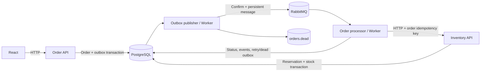

# OrderBridge

A portfolio integration system that takes an order from a React form to a durable warehouse reservation through ASP.NET Core, PostgreSQL and RabbitMQ. It makes failure behavior visible: scheduled retries, business rejections, dead letters, controlled replay and a correlated event timeline.

## Start locally

Install **Docker Desktop with Linux containers and Docker Compose v2**. Docker must be running. From this repository:

```sh
docker compose up --build
```

Open **http://localhost:5173**. Compose waits for infrastructure health, applies the checked-in EF migration and seeds three products once. Named volumes preserve orders, stock, reservation keys and messages across restart. An optional `.env` copied from `.env.example` overrides disposable local credentials; no configuration step is required for the defaults.

| Component | Local address |
| --- | --- |
| React workspace | http://localhost:5173 |
| Order API | http://localhost:5080 |
| Order OpenAPI document | http://localhost:5080/openapi/v1.json |
| Warehouse API / OpenAPI | http://localhost:5081/openapi/v1.json |
| RabbitMQ management | http://localhost:15672 |
| PostgreSQL | localhost:5432 |

RabbitMQ's default demo login is `orderbridge` / `orderbridge-local`. All published ports bind to `127.0.0.1`. These example credentials are **local demo values**, not production secrets.

## What to explore

- Status dashboard and searchable, filtered, paginated orders.
- Order creation with seeded products, backend validation and clear errors.
- Order details with products, retry information, correlation ID and event timeline.
- Actual PostgreSQL, RabbitMQ and warehouse health checks.
- A local simulator for normal operation, slow replies, temporary HTTP errors and insufficient stock.
- Failed-order replay and a real reservation count proving idempotency.

Start with [the demo guide](docs/demo.md): enable TemporaryError, create an order, observe a retry, restore Normal, then see Reserved and one reservation. The guide also covers exhaustion, DLQ, replay and worker restart.

## Architecture



The C# application uses an object-oriented structure with injected services: `OrderService`, `OrderProcessor`, `InventoryService` and `OutboxPublisher`. API endpoints delegate to these classes; the hosted worker owns connection recovery and broker acknowledgment. React separates the order form and HTTP client from the workspace. See [architecture decisions and limitations](docs/architecture.md).

Delivery is **at-least-once with idempotent processing**. Orders and outgoing messages are committed together. Publication waits for RabbitMQ confirms; acknowledgment occurs after database processing commits. Crash windows can create duplicate messages. Stable, database-enforced reservation keys and transactional stock locks prevent duplicate reservations and negative stock. Temporary warehouse errors retry after 5, 15 and 30 seconds; insufficient stock is a final business rejection. Exhausted failures generate a durable dead-letter outbox message. Replay keeps the reservation key and advances the generation to ignore stale deliveries.

## Develop in VS Code or Visual Studio

Prerequisites: **.NET 10 SDK**, **Node.js 24**, and Docker Desktop. Versions are pinned in project files, the npm lockfile and NuGet lockfiles. Open `OrderBridge.slnx` in a .NET 10-compatible Visual Studio, or open this folder in VS Code with C# Dev Kit. Existing editor recommendations are preserved.

Start infrastructure only:

```sh
docker compose up -d postgres rabbit
dotnet restore
dotnet tool restore
```

Run each process in a separate terminal, starting the API first so its migration finishes before the warehouse and worker:

```sh
dotnet run --project src/OrderBridge.Api --launch-profile http
dotnet run --project src/OrderBridge.Inventory --launch-profile http
dotnet run --project src/OrderBridge.Worker
```

Then in another terminal:

```sh
cd frontend
npm ci
npm run dev
```

On Windows PowerShell with restricted script execution, use `npm.cmd` and `npx.cmd`. Vite proxies `/api` to port 5080. Development settings include the same disposable credentials as Compose. If you override them in `.env`, also override `ConnectionStrings__Database` and `RabbitUri` for processes launched outside Compose, or use .NET user secrets. `.env` is not read by .NET automatically.

To add a schema change:

```sh
dotnet ef migrations add YourChange --project src/OrderBridge.Core --output-dir Migrations
```

The API applies pending migrations on startup. The checked-in migration contains deterministic product seed data; it does not refill inventory on subsequent starts.

## Tests and checks

```sh
dotnet build
dotnet test --filter Category=Unit
dotnet test --filter Category=Integration
cd frontend
npm run build
npm test
```

The frontend build includes strict TypeScript checking. Integration tests require Docker and start **real PostgreSQL and RabbitMQ** using Testcontainers. They cover durable duplicate reservations, duplicate messages, business rejection, concurrency, lost responses, scheduled retries, exhaustion, DLQ publication, replay and persisted outbox dispatch. HTTP is replaced with a test handler for service-level tests; the end-to-end suite uses the actual processes and HTTP calls.

With the complete Compose application running:

```sh
cd frontend
npx playwright install chromium
npm run e2e -- --workers=1
```

End-to-end tests cover temporary error recovery with exactly one reservation and exhausted retries with actual RabbitMQ DLQ inspection and replay. They change local demo state; use a disposable development environment. GitHub Actions builds both stacks, runs unit/integration tests, starts Compose and runs browser end-to-end tests, retaining diagnostic artifacts on failure.

### Verification on the authoring machine

- .NET 10.0.401 and Node 24.16.0 were available.
- Backend build passed with zero warnings and errors.
- Five backend unit tests passed.
- Frontend strict TypeScript check and Vite production build passed.
- One frontend order-form test passed.
- Headless Chromium smoke checks passed for desktop/mobile layout, no horizontal overflow and keyboard dialog dismissal against the real frontend with the API offline.
- Integration execution was attempted, but all eight tests were blocked during fixture setup because Docker was unavailable. No PostgreSQL/RabbitMQ assertions ran.
- Compose startup and browser end-to-end tests could not run on this machine because Docker was unavailable. They subsequently passed in GitHub Actions using its Linux Docker environment.

### Continuous integration verification

[The complete CI run](https://github.com/HugoMelander1/orderbridge/actions/runs/36887431921) passed backend/frontend builds, all 14 backend tests (five unit and nine PostgreSQL/RabbitMQ integration tests), the frontend form test, Compose health/startup checks and both browser end-to-end scenarios. The regression coverage includes replay after four lost HTTP responses, stale-generation delivery and the original durable reservation key.

## API examples

```sh
curl -X POST http://localhost:5080/api/orders \
  -H "Content-Type: application/json" \
  -d '{"customer":"Acme Studio","items":[{"sku":"KB-01","quantity":1}]}'
```

| Method | Route | Purpose |
| --- | --- | --- |
| POST | `/api/orders` | Create order and outbox event atomically |
| GET | `/api/orders?search=&status=&page=1` | Ten orders per page |
| GET | `/api/orders/{id}` | Order, products JSON, trace and events |
| GET | `/api/dashboard` | Actual counts by status |
| GET | `/api/products` | Demo catalog and current stock |
| GET | `/api/dependencies` | Live dependency checks and demo availability |
| POST | `/api/orders/{id}/replay` | Replay a Failed order, Development only |
| GET/POST | `/api/demo` | Read/change warehouse mode, Development only |
| GET | `/api/reservations/{id}` | Real successful reservation count, Development only |

Validation and conflict responses use HTTP 400/409 with Problem Details; unknown orders use 404. The OpenAPI documents describe request bodies and routes. JSON console logs and order events retain trace IDs through the integration flow.

## Public deployment and repository hygiene

This repository is prepared for `HugoMelander1/orderbridge`. Build outputs, local data, `.env`, user settings and dependency directories are ignored. Only disposable local credentials appear in example/development configuration. No invented screenshots or integration results are included.

Public deployment requires authentication and authorization, protected warehouse endpoints, proper secret management, TLS, rate limiting and separate database ownership. Run production services in Production; demo and replay routes are not mapped there. Do not expose the Development Compose stack publicly. The current single worker and shared database are documented portfolio tradeoffs, not a production scale claim.

