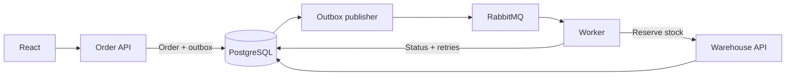

# OrderBridge

A C#/.NET project that connects order processing with warehouse reservations.

I focused on the parts of an integration that are easy to miss when everything works: lost responses, duplicate messages and a warehouse that is temporarily unavailable. An order can be followed from creation to reservation, including each failed attempt and retry.

**[Open the demo](https://orderbridge-hugo-demo.hugomelander1.chatgpt.site)** · [Architecture](docs/architecture.md) · [Development guide](docs/development.md)

The online demo simulates the backend in the browser so it can be tried without installation. Each visitor gets separate data that resets on reload. The repository contains the full ASP.NET Core backend with PostgreSQL and RabbitMQ.

## Try the order flow

1. Create an order and open its details to follow the event timeline.
2. Set the warehouse mode to **TemporaryError** and create another order.
3. Switch back to **Normal** to watch a retry complete the reservation.

Leave the error enabled to see the order fail after four attempts. Restore Normal and use **Replay order** to process it again. The **Delayed** mode demonstrates a lost response: the warehouse can reserve stock even though the caller times out, and a later attempt must avoid reserving it twice.

## Stack

| Area | Technologies |
| --- | --- |
| Backend | C#, .NET 10, ASP.NET Core |
| Data | PostgreSQL, Entity Framework Core |
| Messaging | RabbitMQ, transactional outbox |
| Frontend | React, TypeScript, Vite |
| Testing | xUnit, Testcontainers, Vitest, Playwright |
| Local environment and CI | Docker Compose, GitHub Actions |

## Design choices

**Save the order and message together.** Creating an order also writes an outbox row in the same database transaction. The worker publishes it to RabbitMQ, so a broker outage does not leave an accepted order without a message to process.

**Expect duplicate delivery.** Messages are processed at least once. The warehouse stores a reservation decision against the order ID, allowing repeated requests to return that decision without reducing stock again.

**Separate temporary errors from stock problems.** Temporary failures retry after 5, 15 and 30 seconds. Insufficient stock rejects the order immediately. Exhausted failures produce a message in `orders.dead`; replay keeps the original reservation key.

**Keep the processing visible.** Order details show status, errors, retry timing, correlation IDs and an event timeline. This makes it possible to inspect a failure from the interface and follow it through the logs.



## Code structure

The HTTP layer handles requests and responses. Application services handle order creation, processing and reservations; domain objects hold order state and replay behavior. EF Core and RabbitMQ code have their own folders.

```text
src/
  OrderBridge.Api/          Order endpoints and startup
  OrderBridge.Inventory/    Warehouse endpoints and startup
  OrderBridge.Worker/       Background processing
  OrderBridge.Core/
    Domain/                 Orders, products, reservations and events
    Contracts/              API and message records
    Application/            Business logic and validation
    Data/                   Database context and read queries
    Infrastructure/         Broker connections and outbox publishing
frontend/src/demo/          Browser simulation: services, data and scheduling
```

The [architecture notes](docs/architecture.md) cover transaction boundaries, retries and the tradeoffs behind this structure.

## Run the full application locally

With Docker Desktop running in Linux container mode:

```sh
docker compose up --build
```

Open <http://localhost:5173> once the services have started. The database is created automatically and seeded with three products. Docker volumes keep orders and stock between restarts.

For running the services individually, local credentials and API examples, see the [development guide](docs/development.md). The [demo guide](docs/demo.md) includes worker restarts and inspecting the dead-letter queue.

## Tests

Backend tests cover validation, reservations, duplicate delivery, retries and replay. Integration tests use real PostgreSQL and RabbitMQ containers. Frontend tests cover the order form and browser simulation, with Playwright scenarios for the full application.

```sh
dotnet test
cd frontend
npm ci
npm test
```

Docker is required for the backend integration tests. Build and browser-test commands are in the [development guide](docs/development.md); CI runs are in [GitHub Actions](https://github.com/HugoMelander1/orderbridge/actions).

## Current scope

This is a portfolio project. The full backend uses a shared database and a single worker to keep the integration easy to run and inspect. Authentication and production deployment are outside its current scope. The public browser demo is separate from that backend.
