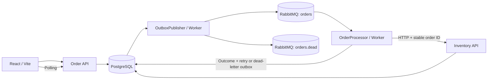

# Architecture and decisions

## Object-oriented responsibilities

- **OrderService** validates and creates orders atomically with outbox messages, and controls replay.
- **OrderProcessor** coordinates one message attempt, reservation HTTP communication, outcome, retry policy and event persistence.
- **InventoryService** owns reservation transactions, stock locking and durable idempotency.
- **OutboxPublisher** owns publication and database dispatch bookkeeping.
- **Worker** owns service scopes, queue polling, acknowledgments and connection recovery.
- **BridgeDb** defines persistence mappings and database constraints.
- React components own view state; **ApiClient** handles HTTP and consistent error decoding.

Services are injected through ASP.NET Core's container. EF Core already supplies unit-of-work and repository behavior; another repository abstraction would add little value. The solution uses concrete classes, composition and small methods rather than an inheritance hierarchy.

## Delivery and crash boundaries

Delivery is **at-least-once with idempotent processing**. There is no exactly-once guarantee.

Creating an order uses one EF Core SaveChanges transaction for the order, initial timeline event and outbox row. Outbox publishers claim due rows with FOR UPDATE SKIP LOCKED. RabbitMQ queues are durable and messages persistent. The publisher uses mandatory routing and awaited publisher confirms before marking rows as published. A crash after broker confirmation but before the database commit causes duplicate publication.

The consumer locks an order while processing. It checks the generation and attempt encoded in the message, plus terminal status. The outcome, timeline and any scheduled retry or dead-letter message are committed together before ACK. A crash before ACK causes redelivery. An HTTP response lost after a warehouse commit can also cause repeated reservation calls. The warehouse stores a unique OrderId reservation key and canonical request payload in PostgreSQL; it returns the same decision after restart. Reusing a key with different products returns HTTP 409.

Reservations lock the idempotency key using a PostgreSQL transaction advisory lock, then product rows in SKU order. Stock changes and reservation insertion share a transaction. A database CHECK constraint prevents negative stock. Insufficient inventory reserves nothing, stores a durable rejection, and does not retry.

## Retry and replay

Temporary HTTP 5xx, 408, 429, network failures and timeouts retry after **5, 15 and 30 seconds**. There are four HTTP attempts in total. Due times are persisted in outbox rows, so retries survive worker restart. Other HTTP errors fail immediately. Unexpected infrastructure/processing exceptions leave the broker message unacknowledged and reconnect after five seconds; they do not get mistaken for a warehouse business rejection.

After exhaustion, Failed status and a message addressed to orders.dead are saved atomically. This is application-managed dead lettering through the outbox. The orders queue also has native dead-letter routing for malformed messages rejected by the consumer.

A local-only replay endpoint locks the failed order, increments its processing generation and creates a new outbox message. Old-generation messages are ignored. The original reservation key is preserved. Dead-letter messages remain as diagnostic history; replay creates a new delivery rather than deleting a DLQ entry.

## Traceability

OrderId, MessageId and CorrelationId appear in worker JSON log scopes and timeline entries. HTTP carries X-Correlation-ID and X-Message-ID; the inventory logs its order and correlation IDs. JSON console scopes are enabled. The browser exposes correlation IDs and actual reservation counts in local development.

## Deliberate limitations

This is a local portfolio application, not a public multi-tenant service. Authentication, authorization, rate limiting, TLS termination and protected simulator connectivity are prerequisites for public deployment. Demo and replay routes are only mapped in Development; Compose intentionally sets Development for the local demo.

One database is shared by order and warehouse tables to simplify local infrastructure, although reservation is a real HTTP call to a separate process. A production integration would use separate database credentials and ownership. The worker processes one message at a time; a database lock is held during the bounded HTTP request. This favors understandable correctness over throughput. Consumer polling is appropriate for this demo but a subscription consumer is preferable at scale.

The UI's dependency checks cover PostgreSQL, RabbitMQ and the warehouse HTTP health endpoint, not worker liveness. Stock is finite and never replenished automatically. Published outbox rows, events, reservations and dead letters have no retention policy yet. Local user/customer names should be demo data only. Images use stable major/minor tags and can receive patches; fully reproducible deployments should pin verified image digests.

The Delayed mode sleeps for 12 seconds against an 8-second worker timeout. A reservation can commit after the caller times out. Restoring Normal allows a retry to retrieve the durable decision without another stock decrement.
